# Sistema de Controle de Não Conformidades (Norma ISO 9001)
**Trabalho de Conclusão de Curso (TCC) — Desenvolvimento Avançado em ADVPL/Protheus**

## Integrante
Adelmo de Santana Silva


## Introdução e Contextualização

Este repositório armazena o ecossistema completo de código-fonte e parametrizações do projeto desenvolvido para a **Indústria XYZ**. A solução visa automatizar o processo de gestão da qualidade no recebimento de materiais, integrando regras de compliance e rastreabilidade exigidas pela certificação internacional **ISO 9001**. 

O sistema foi concebido de forma nativa e integrada ao módulo de **Compras (SIGACOM)** do TOTVS Protheus utilizando persistência em tabelas customizadas e componentes visuais para garantir a consistência das auditorias de qualidade.

---

## O Problema de Negócio

A Indústria XYZ enfrentava severas dificuldades devido ao controle descentralizado de suas ordens de recebimento. Os principais problemas identificados foram:
* **Vulnerabilidade em Auditorias:** Falta de rastreabilidade entre os lotes de materiais entregues e os certificados de qualidade vigentes dos fornecedores.
* **Prejuízo por Falha Operacional:** Inexistência de um bloqueio sistêmico automatizado que impedisse a entrada de insumos quando o índice de rejeição técnica ultrapassasse a tolerância comercial acordada.
* **Riscos de Integridade Referencial:** Exclusões acidentais de históricos de fornecimento no banco de dados que possuíam amarrações e dependências com ocorrências ativas.

---

## Estrutura do Projeto


```text
TCC/
 ├── Dados-e-Dicionario/
 │ ├── sa2990.csv ← Fornecedores de teste
 │ ├── sb1990.csv ← Produtos de teste
 │ ├── sigacom.xnu ← Menu de Compras
 │ ├── six990.csv ← Dicionário de Índices
 │ ├── sx2990.csv ← Dicionário de Tabelas
 │ ├── sx3990.csv ← Dicionário de Campos
 │ ├── sx7990.csv ← Dicionário de Gatilhos
 │ ├── sxb990.csv ← Dicionário de Consultas
 │ ├── zz1990.csv ← Tabela ZZ1
 │ └── zz2990.csv ← Tabela ZZ2
 ├── evidencias/ ← prints das evidências 
 ├── TCC.PRJ ← Projeto DevStudio
 ├── STTZZ1.PRW ← Rotina mBrowse da ZZ1
 ├── STTZZ2.PRW ← Rotina mBrowse da ZZ2
 └── STTZZLIB.PRW ← Biblioteca de funções comuns
```

### Componentes Chave da Solução:
1. **Dicionário Blindado (SX3/SX7):** Uso de escudos lógicos (`Empty() .Or.`) para neutralizar travamentos de inicialização dinâmica no Protheus.
2. **Camada de Legendas Dinâmicas:** Aplicação de constantes cromáticas oficiais (`BR_VERMELHO`, `BR_AMARELO`, `BR_VERDE`) que atualizam o grid visual em tempo real com base no vencimento de certificados e no estouro percentual de não conformidades.
3. **Tratamento Estruturado de Erros:** Implementação de integridade referencial via blocos `BEGIN SEQUENCE` na função de exclusão, capturando exceções e direcionando para a classe de auditoria em POO.

| Nº | Etapa                                                                                    |
| -: | ---------------------------------------------------------------------------------------- |
|  1 | Configuração da Tabela ZZ1                                                               |
|  2 | Configuração da Tabela ZZ2                                                               |
|  3 | Telas de ZZ1                                                                             |
|  4 | Telas de ZZ2                                                                             |
|  5 | Tabelas no Menu SIGACOM                                                                  |
|  6 | Configuração da Consulta Padrão                                                          |
|  7 | Tratamento de Erros com BEGIN SEQUENCE e Impedir Exclusão de ZZ1 se houver ZZ2 Vinculada |
|  8 | Classe ADVPL – Programação Orientada a Objetos                                           |
|  9 | Biblioteca STTZZLIB                                                                      |
---

# 1. Tabela e Configuração ZZ1:  

##  Estrutura da Tabela ZZ1 — Controle de Fornecimento

* **Acesso:** Compartilhado  
* **Índice 1 (Chave Primária):** `ZZ1_FILIAL + ZZ1_CODIGO`  
* **Índice 2:** `ZZ1_FILIAL + ZZ1_FORNEC + ZZ1_LOJAFO`  
* **Índice 3:** `ZZ1_FILIAL + DTOS(ZZ1_VALCER)`  

| Título | Campo | Tipo | Tam | Dec | Contexto | Validação do Usuário (X3_VRELOCO) / Regra |
| :--- | :--- | :---: | :---: | :---: | :---: | :--- |
| Filial | ZZ1_FILIAL | C | 2 | 0 | Real | Preenchimento automático do sistema |
| Código | ZZ1_CODIGO | C | 6 | 0 | Real | Chave Primária |
| Cod. Fornece | ZZ1_FORNEC | C | 6 | 0 | Real | `Empty(M->ZZ1_FORNEC) .Or. ExistCpo("SA2", M->ZZ1_FORNEC + M->ZZ1_LOJAFO, 1)` |
| Loja Fornece | ZZ1_LOJAFO | C | 2 | 0 | Real | Vínculo com cadastro padrão SA2 |
| Nome Fornece | ZZ1_NOMEFO | C | 40 | 0 | Virtual | `Posicione("SA2",1,xFilial("SA2")+If(INCLUI.Or.ALTERA,M->ZZ1_FORNEC,ZZ1->ZZ1_FORNEC)+If(INCLUI.Or.ALTERA,M->ZZ1_LOJAFO,ZZ1->ZZ1_LOJAFO),"A2_NOME")` *(Inicializador de Browse)* |
| Dados Certif | ZZ1_CERTIF | C | 256| 0 | Real | Texto livre para descrição do certificado |
| Val. Certifi | ZZ1_VALCER | D | 8 | 0 | Real | `Empty(M->ZZ1_VALCER) .Or. M->ZZ1_VALCER >= dDataBase` |
| Tolerância | ZZ1_TOLERA | N | 5 | 2 | Real | `Empty(M->ZZ1_TOLERA) .Or. M->ZZ1_TOLERA >= 0 .And. M->ZZ1_TOLERA <= 100` |
| Tot. Itens OK| ZZ1_TOTOK | N | 12| 2 | Real | `@E 999,999,999.99` |
| Tot. Itens NOK| ZZ1_TOTNOK| N | 12| 2 | Real | `@E 999,999,999.99` |


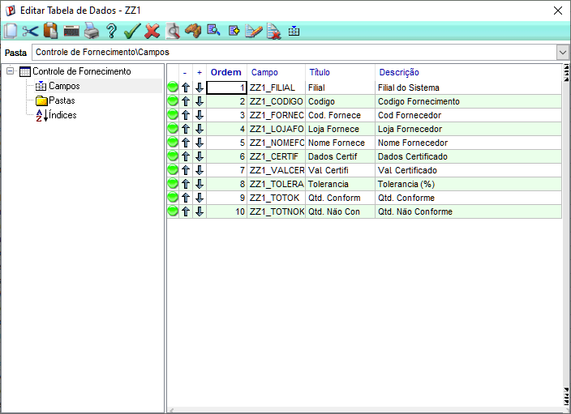

##  Configuração dos Índices da Tabela ZZ1

Os índices foram estruturados para otimizar as buscas por fornecedores e datas, utilizando a padronização oficial do Protheus e o tratamento correto para campos de data (`DTOS`), evitando duplicidades ou falhas de ordenação no banco CodeBase.

| Ordem | Chave do Índice (Expressão) | Descrição / Propósito do Uso | Tipo de Chave |
| :---: | :--- | :--- | :---: |
| **1** | `ZZ1_FILIAL + ZZ1_CODIGO` | Chave primária de controle do sistema para identificação única do registro. | Exclusiva |
| **2** | `ZZ1_FILIAL + ZZ1_FORNEC + ZZ1_LOJAFO` | Utilizado para buscas rápidas por fornecedor específico e amarração de histórico. | Cadastral |
| **3** | `ZZ1_FILIAL + DTOS(ZZ1_VALCER)` | Mapeamento cronológico das validades para alimentar a regra de cores do painel principal. | Relatório |

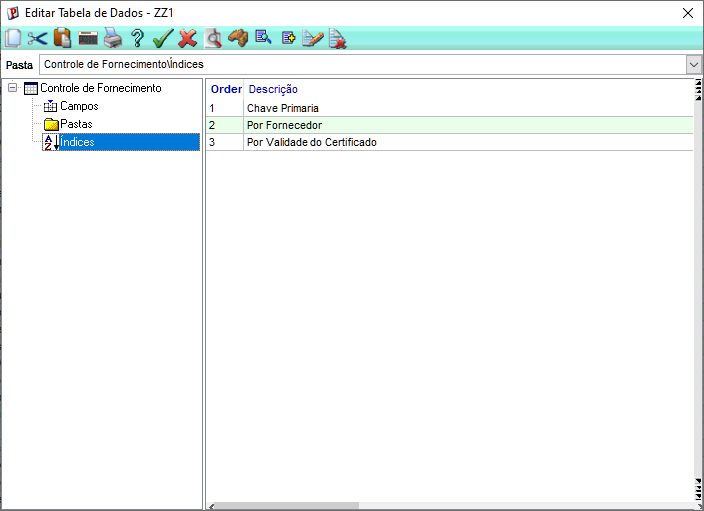

## Campo Virtual NOMEFO

O campo é virutal, então precisa buscar o nome tabalea SA1 com GetNomeFor()

```advpl
USER FUNCTION GetNomeFor()
			LOCAL cFornec := If(Type("M->ZZ1_FORNEC") == "C", M->ZZ1_FORNEC, ZZ1->ZZ1_FORNEC)
			LOCAL cLoja   := If(Type("M->ZZ1_LOJAFO") == "C", M->ZZ1_LOJAFO, ZZ1->ZZ1_LOJAFO)
RETURN Posicione("SA2", 1, xFilial("SA2") + cFornec + cLoja, "A2_NOME")   
```

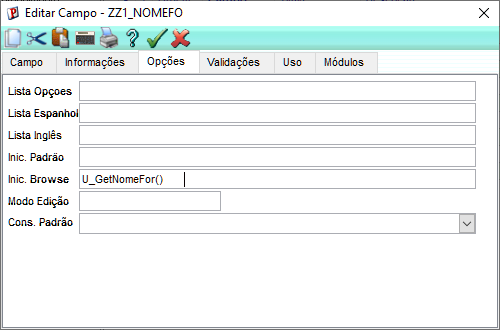

## Explicação das Validações da Tabela ZZ1

As validações do usuário (**X3_VRELOCO**) foram projetadas para garantir a integridade dos dados e, simultaneamente, servir como um "escudo antitrava" (`Empty() .Or.`) para o motor de macros do Protheus, impedindo erros de inicialização com campos vazios.

* **Código do Fornecedor (`ZZ1_FORNEC`):**
  * **Fórmula:** `Empty(M->ZZ1_FORNEC) .Or. ExistCpo("SA2", M->ZZ1_FORNEC + M->ZZ1_LOJAFO, 1)`
  * **Explicação:** Se o campo estiver preenchido, o Protheus busca no cadastro padrão (`SA2`) para garantir que o fornecedor existe. A remoção do código de filial isola a busca contra conflitos de tabelas compartilhadas.

* **Validade do Certificado (`ZZ1_VALCER`):**
  * **Fórmula:** `Empty(M->ZZ1_VALCER) .Or. M->ZZ1_VALCER >= dDataBase`
  * **Explicação:** Bloqueia a inserção de certificados com datas retroativas no momento da inclusão, garantindo que o documento inserido esteja de acordo com a data atual do servidor.

* **Limite de Tolerância (`ZZ1_TOLERA`):**
  * **Fórmula:** `Empty(M->ZZ1_TOLERA) .Or. M->ZZ1_TOLERA >= 0 .And. M->ZZ1_TOLERA <= 100`
  * **Explicação:** Restringe a digitação de parâmetros de auditoria a valores percentuais matematicamente aceitáveis (obrigando o intervalo exato entre 0% e 100%).

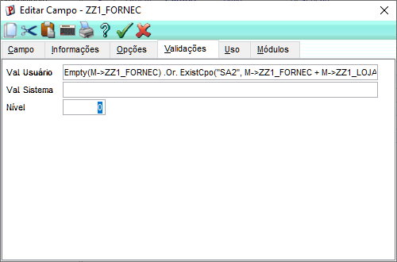
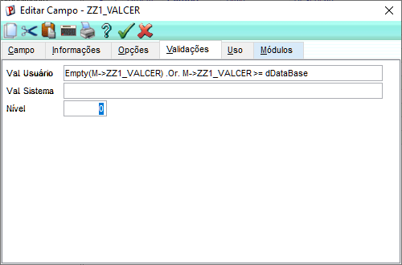
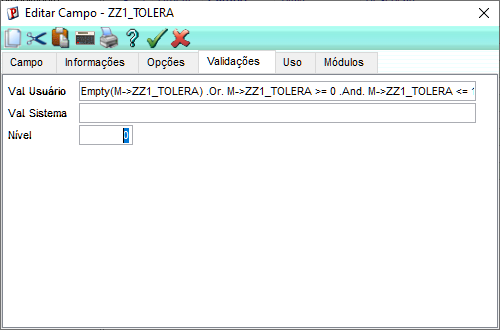

`Posicione("SA2", 1, xFilial("SA2") + M->ZZ1_FORNEC + M->ZZ1_LOJAFO, "A2_NOME")`
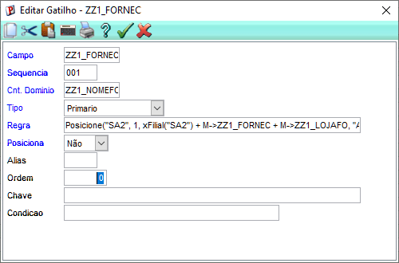


# 2. Tabela e Configuração ZZ2:

## Estrutura da Tabela ZZ2 — Ocorrências do Fornecedor

* **Acesso:** Compartilhado  
* **Índice 1 (Chave Primária):** `ZZ2_FILIAL+ZZ2_CONFOR+DTOS(ZZ2_DATA)+ZZ2_HORA`  
* **Índice 2:** `ZZ2_FILIAL+ZZ2_FORNEC+ZZ2_LOJAFO+DTOS(ZZ2_DATA)`  
* **Índice 3:** `ZZ2_FILIAL+DTOS(ZZ2_DATA)`  

| Título | Campo | Tipo | Tam | Dec | Contexto | Validação do Usuário (X3_VRELOCO) / Regra |
| :--- | :--- | :---: | :---: | :---: | :---: | :--- |
| Filial | ZZ2_FILIAL | C | 2 | 0 | Real | Preenchimento automático do sistema |
| Cód. Controle| ZZ2_CONFOR | C | 6 | 0 | Real | `Empty(M->ZZ2_CONFOR) .Or. ExistCpo("ZZ1", M->ZZ2_CONFOR, 1)` |
| Cód. Produto | ZZ2_CODPRO | C | 15| 0 | Real | `Empty(M->ZZ2_CODPRO) .Or. ExistCpo("SB1", xFilial("SB1") + M->ZZ2_CODPRO, 1)` |
| Valor Unitário| ZZ2_VLRUNI | N | 12| 2 | Real | Formato de digitação: `@E 999,999,999.99` |
| Qtd. Conforme | ZZ2_QTDOK  | N | 12| 0 | Real | Quantidade de peças aprovadas na inspeção |
| Qtd. Rejeitada| ZZ2_QTDNOK | N | 12| 0 | Real | Quantidade de peças reprovadas na inspeção |
| Data Ocorren. | ZZ2_DATA   | D | 8 | 0 | Real | `Empty(M->ZZ2_DATA) .Or. M->ZZ2_DATA <= dDataBase` |
| Hora Ocorren. | ZZ2_HORA   | C | 5 | 0 | Real | Preenchimento do horário do servidor (`Time()`) |
| Total Conf.   | ZZ2_TOTOK  | N | 12| 2 | Virtual | `If(INCLUI.Or.ALTERA,M->ZZ2_QTDOK*M->ZZ2_VLRUNI,ZZ2->ZZ2_QTDOK*ZZ2->ZZ2_VLRUNI)` |
| Total Rejeit. | ZZ2_TOTNOK | N | 12| 2 | Virtual | `If(INCLUI.Or.ALTERA,M->ZZ2_QTDNOK*M->ZZ2_VLRUNI,ZZ2->ZZ2_QTDNOK*ZZ2->ZZ2_VLRUNI)` |

---
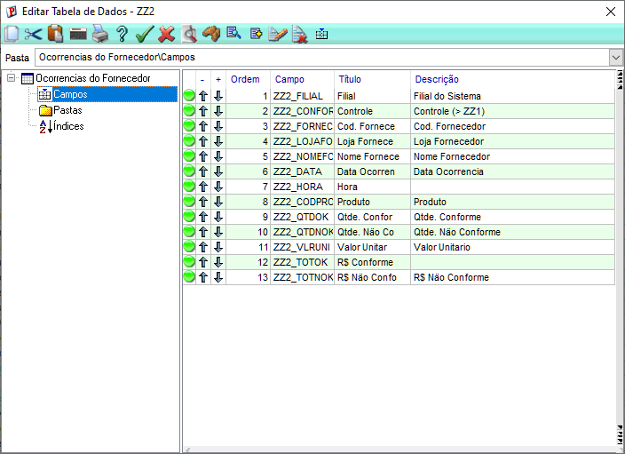

## Configuração dos Índices da Tabela ZZ2

| Ordem | Chave do Índice (Expressão) | Descrição / Propósito do Uso | Tipo de Chave |
| :---: | :--- | :--- | :---: |
| **1** | `ZZ2_FILIAL+ZZ2_CONFOR+DTOS(ZZ2_DATA)+ZZ2_HORA` | Chave primária combinada para ordenar cronologicamente as ocorrências de um mesmo certificado. | Exclusiva |
| **2** | `ZZ2_FILIAL+ZZ2_FORNEC+ZZ2_LOJAFO+DTOS(ZZ2_DATA)` | Agrupamento de histórico para auditorias rápidas de desvios técnicos por fornecedor. | Cadastral |
| **3** | `ZZ2_FILIAL+DTOS(ZZ2_DATA)` | Ordenação temporal para emissão de relatórios de não conformidades por período. | Relatório |

---
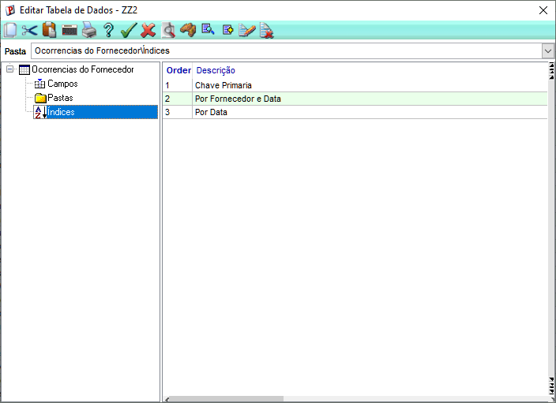

## Campo Virutal NOMEFO:
Precisa buscar o nome na tabela SA2

```advpl
USER FUNCTION BrowseNomeFor()
    LOCAL cFornec := If(Type("M->ZZ2_FORNEC") == "C", M->ZZ2_FORNEC, ZZ2->ZZ2_FORNEC)
    LOCAL cLoja   := If(Type("M->ZZ2_LOJAFO") == "C", M->ZZ2_LOJAFO, ZZ2->ZZ2_LOJAFO)
RETURN Posicione("SA2", 1, xFilial("SA2") + cFornec + cLoja, "A2_NOME")    
```
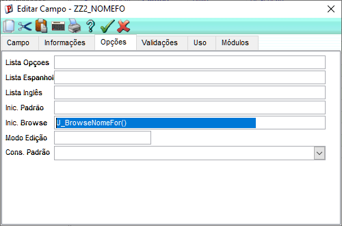

## Explicação das Validações da Tabela ZZ2

* **Código de Controle (`ZZ2_CONFOR`):**
  * **Fórmula:** `Empty(M->ZZ2_CONFOR) .Or. ExistCpo("ZZ1", M->ZZ2_CONFOR, 1)`
  * **Explicação:** Garante a integridade referencial validando se o código digitado existe na tabela pai `ZZ1`. O escudo `Empty()` previne falhas de macro ao inicializar a tela.
* **Código do Produto (`ZZ2_CODPRO`):**
  * **Fórmula:** `Empty(M->ZZ2_CODPRO) .Or. ExistCpo("SB1", xFilial("SB1") + M->ZZ2_CODPRO, 1)`
  * **Explicação:** Bloqueia a inserção de insumos inexistentes, obrigando que o material faça parte do cadastro padrão de produtos do Protheus (`SB1`).
* **Data da Ocorrência (`ZZ2_DATA`):**
  * **Fórmula:** `Empty(M->ZZ2_DATA) .Or. M->ZZ2_DATA <= dDataBase`
  * **Explicação:** Impede o lançamento retroativo ou futuro de inspeções de qualidade, amarrando o registro ao dia de trabalho logado.

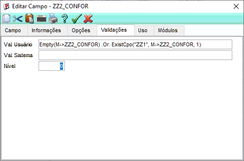
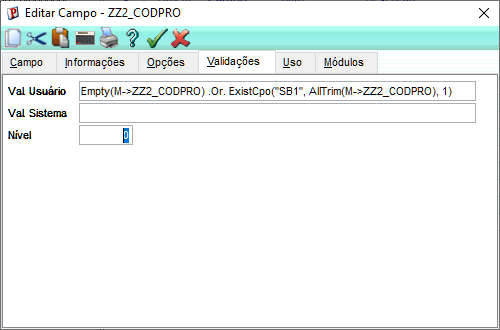
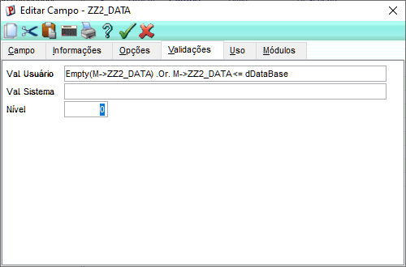

## Configuração de Gatilhos da Tabela ZZ2 (Dicionário SX7)

| Campo Origem | Campo Destino | Tipo | Regra / Fórmula Executada (Linha Única) |
| :---: | :---: | :---: | :--- |
| **ZZ2_CONFOR** | `ZZ2_FORNEC` | Estrangeiro | `Posicione("ZZ1",1,xFilial("ZZ1")+M->ZZ2_CONFOR,"ZZ1_FORNEC")` |
| **ZZ2_CONFOR** | `ZZ2_LOJAFO` | Estrangeiro | `Posicione("ZZ1",1,xFilial("ZZ1")+M->ZZ2_CONFOR,"ZZ1_LOJAFO")` |
| **ZZ2_CONFOR** | `ZZ2_NOMEFO` | Estrangeiro | `Posicione("SA2",1,xFilial("SA2")+M->ZZ2_FORNEC+M->ZZ2_LOJAFO,"A2_NOME")` |

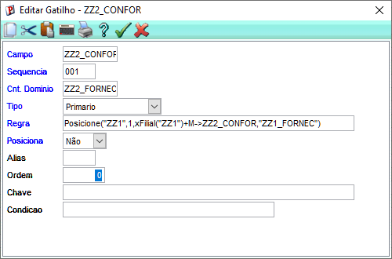
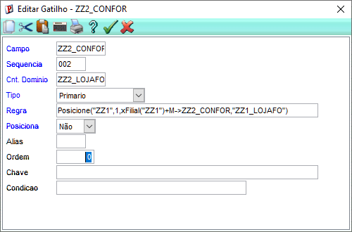
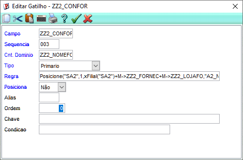

## Inicialização Automática de Campos (Início Padrão - X3_INICPAD)

Para otimizar a usabilidade e evitar erros humanos de digitação, os campos de temporalidade da tabela ZZ2 não utilizam gatilhos manuais, mas sim a propriedade de **Início Padrão** do dicionário de dados.

| Campo | Título | Tipo | Fórmula de Inicialização Nativa |
| :---: | :--- | :---: | :--- |
| **ZZ2_DATA** | Data Ocorrência | D | `dDataBase` |
| **ZZ2_HORA** | Hora Ocorrência | C | `Time()` |

### Funcionamento Técnico
* **`dDataBase`**: Função nativa que captura a data de trabalho ativa no sistema Protheus. Assim que o usuário clica no botão "Incluir", o campo é preenchido no ato, sem travar o motor de macros do formulário.
* **`Time()`**: Função que lê o relógio do servidor de aplicação (AppServer). Retorna uma string formatada em `HH:MM`, registrando o momento exato em que a inspeção foi aberta.

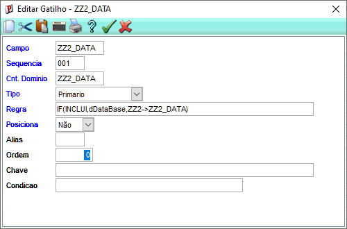
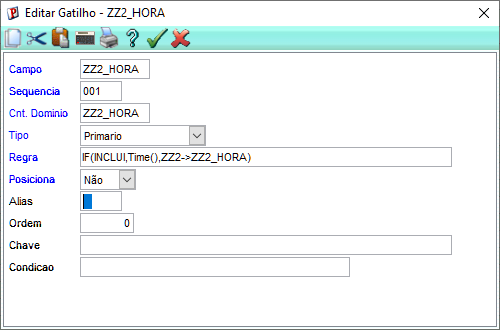

## Inicio Padrão Data e Hora

Foram preenchidos os iniciadores para capturar a Data e Hora atuais no momento da inclusão. 
```advpl
IF(INCLUI, DDATABASE, ZZ->ZZ2_DATA)
IF(INCLUI, SUBSTR(TIME(), 1, 5), ZZZ2->ZZ2_HORA)
```

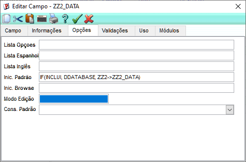
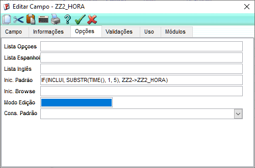

## Funções de Totalização Financeira Dinâmica (Camada de Regras)

As funções virtuais atuam diretamente nas colunas de exibição da grade para calcular o impacto financeiro dos lotes, eliminando a necessidade de gravação redundante no banco de dados.

| Função | Campo Destino | Regra de Cálculo Matemático |
| :--- | :---: | :--- |
| **`U_CalcTotOk()`** | `ZZ2_TOTOK` | `Quantidade Aprovada (QTDOK) × Valor Unitário (VLRUNI)` |
| **`U_CalcTotNok()`** | `ZZ2_TOTNOK` | `Quantidade Rejeitada (QTDNOK) × Valor Unitário (VLRUNI)` |

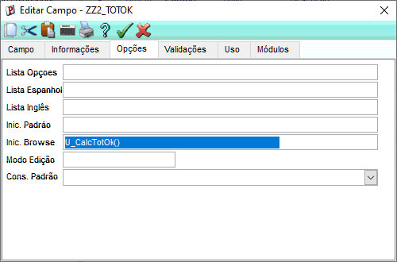
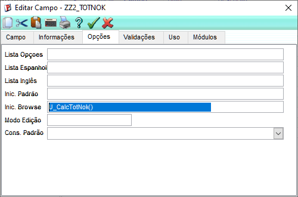

# 3. Telas de ZZ1:
## Inclusão
Esta interface é utilizada para cadastrar um novo Certificado de Qualidade ISO 9001 no sistema.
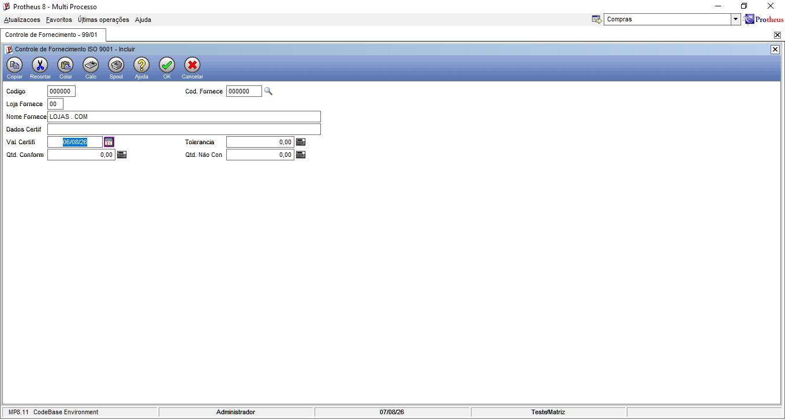

## Listagem
Esta interface exibe a visão geral de todos os Certificados de Qualidade cadastrados no sistema.  
A listagem principal utiliza cores automáticas nos quadradinhos ao lado do código para indicar o status de validade de cada certificado:

* **Vermelho:** O certificado está vencido (a data de validade é menor que o dia de hoje).
* **Amarelo:** O certificado está perto de vencer (faltam menos de 30 dias para expirar).
*  **Verde:** O certificado está totalmente regular e seguro (vencerá apenas daqui a mais de 30 dias).

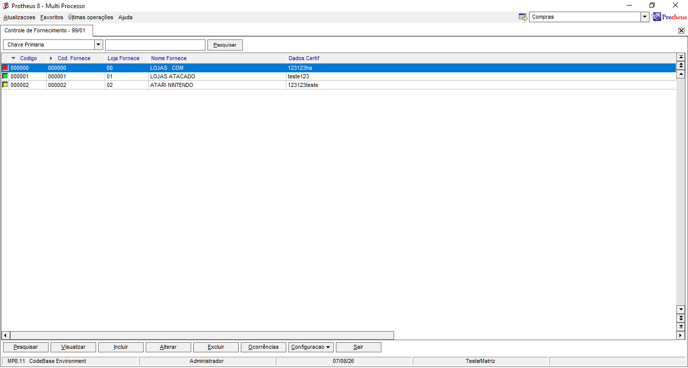

## Consulta Padrão 
Esta interface é a que se abre quando o usuário clica na lupa no campo de fornecedor.

*   **Codigo:** Exibe o identificador único do fornecedor gravado no banco de dados.
*   **Loja:** Exibe a filial correspondente ao estabelecimento do fornecedor.
*   **Razao Social:** Exibe o nome por extenso da empresa cadastrada no Protheus.


## Botão de Ocorrência
Este botão customizado fica localizado no menu inferior da tela principal e serve como ponte de ligação entre as duas tabelas do sistema.
* **Filtro Automático:** Ao selecionar um Certificado de Fornecimento (`ZZ1`) e clicar em **Ocorrências**, o sistema abre a tela filha (`ZZ2`) exibindo apenas as entregas daquele registro específico.
* **Segurança de Dados:** Ele impede que o usuário veja movimentações de outros fornecedores misturadas na mesma tela.


## Erro ao excluir algum certificado de qualidade
Esta janela de alerta é disparada automaticamente pela rotina customizada quando um usuário tenta apagar um registro pai que possui amarrações.


# 4. Telas de ZZ2:

## Inclusão
Esta interface é utilizada para registrar as inspeções de qualidade de cada lote de material recebido dos fornecedores.
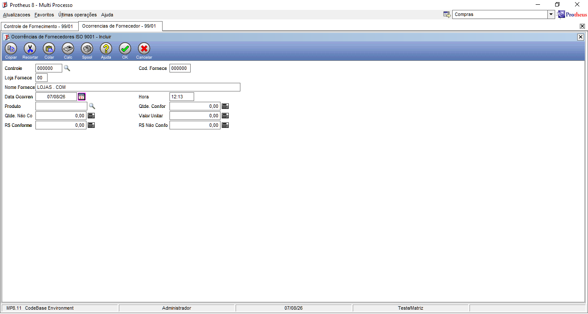

## Listagem 
Esta interface exibe em formato de grade todas as inspeções de recebimento e ocorrências registradas no sistema.

#### Regra de Tolerância
O browse realiza um cálculo percentual cruzado em tempo real para pintar as linhas e indicar o status de qualidade do lote entregue:

* **Vermelho (Fora da Tolerância):** A quantidade de peças rejeitadas (`QTDNOK`) ultrapassou o limite percentual de tolerância cadastrado para aquele fornecedor lá na tabela pai (`ZZ1_TOLERA`).

* **Verde (Lote Conforme):** O índice de peças rejeitadas ficou dentro da margem aceitável ou foi zerado, respeitando os critérios da ISO 9001.
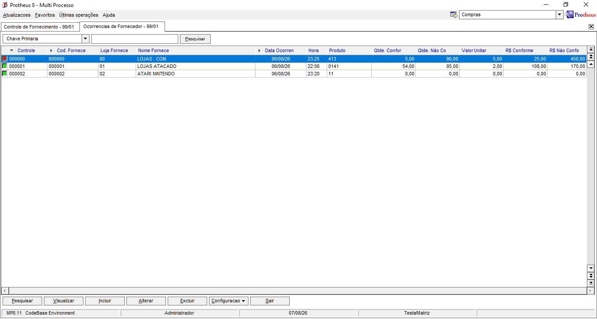

## Consulta Padrão - Controle de Fornecimento
Esta interface é que se abre quando o usuário clica na lupa no campo **Controle** da tela de ocorrências.
*   **Codigo:** Código único do controle de fornecimento registrado na tabela pai (ZZ1).
*   **Nome Fornecedor:** Traz o nome do parceiro comercial direto da tabela SA2 em tempo de execução, usando a nossa função de biblioteca.
*   **Val Certifi:** Exibe a data de validade do certificado ISO 9001 cadastrado.


## Consulta Padrão - Produtos
Esta interface é que se abre quando o usuário clica na lupa no campo **Produto** da tela de ocorrências.

*   **Codigo:** Exibe o identificador único do produto gravado no cadastro padrão da tabela SB1.
*   **Descricao:** Traz o nome por extenso do item.
*   **Unidade:** Exibe a unidade de medida do produto (Ex: G, BD, AR, DZ).


# 5. Tabelas no Menu SIGACOM

## Interface inicial SIGACOM:
**ATUALIZAÇÕES > Cadastro > Controle Iso 9001**

Dois novos menus adicionados ao menu de Compras do SIGACOM: Controle de Fornecimento e Ocorrências de Fornecimento


### Controle de Fornecimento - ZZ1
Menu Visual no módulo de compras do SIGACOM


### Ocorrências de Fornecimento - ZZ2
Menu Visual no módulo de compras do SIGACOM


# 6. Configuração Consulta Padrão:

## Configuração da Consulta Padrão — ZZ1 
Esta seção documenta a estrutura interna criada no Configurador (SIGACFG)

Define as propriedades básicas de identificação e o tipo de comportamento do componente de pesquisa:
*   **Tipo de Consulta:** Marcado como **Consulta Padrão** (SXB) para amarrar diretamente à estrutura física de tabelas.
*   **Consulta:** Identificador único cadastrado no sistema como `C_ZZ1`.
*   **Descrição:** Nome descritivo multilíngue definido como `Busca Controle` para guiar a operação nos dicionários.

---


Define como o Protheus ordenará e exibirá os dados dentro do grid flutuante de busca:

#### Índices Utilizados
*   **Ordem 1 (Chave Primária):** Força o componente F3 a organizar a listagem baseado na chave única sequencial para acelerar o tempo de resposta da busca.

#### Configuração de Colunas do Grid
*   **Codigo (`ZZ1_CODIGO`):** Retorna o código numérico do controle para o formulário.
*   **Nome Fornecedor (`U_NomeFornecedor(...)`):** Linha customizada com a nossa função ponte da biblioteca para exibir a Razão Social sem estourar o limite de caracteres da caixa de texto do dicionário.
```advpl
USER FUNCTION NomeFornecedor(cFornec, cLoja)
RETURN Posicione("SA2", 1, xFilial("SA2") + cFornec + cLoja, "A2_NOME")
```
*   **Val Certifi (`ZZ1_VALCER`):** Exibe a data de validade do documento para orientação imediata do operador.


## Configuração da Consulta Padrão — Produtos

Esta seção documenta a estrutura interna criada no Configurador (SIGACFG) 

Define as propriedades básicas de identificação do componente de pesquisa:
*   **Tipo de Consulta:** Marcado como **Consulta Padrão** para se integrar nativamente ao dicionário SXB do Protheus.
*   **Consulta:** Identificador único cadastrado no sistema como `C_SB1`.
*   **Descrição:** Nome descritivo padrão definido como `Consulta SB1`.


#### Índices Utilizados
*   **Ordem 1 (Codigo):** Utiliza o índice padrão por código de produto da tabela SB1 para garantir uma listagem rápida e ordenada.

#### Configuração de Colunas do Grid
*   **Codigo (`B1_COD`):** Coluna que exibe o código do produto e o retorna para o campo do formulário.
*   **Descricao (`B1_DESC`):** Coluna que traz o nome ou descrição por extenso do material cadastrado.
*   **Unidade (`B1_UM`):** Coluna que exibe a unidade de medida do produto (Ex: UN, PC, KG) para orientação do usuário.


## Configuração da Consulta Padrão — Fornecedores
Esta seção documenta a estrutura interna criada no Configurador (SIGACFG)

Define as propriedades básicas de identificação do componente de pesquisa:
*   **Tipo de Consulta:** Marcado como **Consulta Padrão** para se integrar nativamente ao dicionário SXB do Protheus.
*   **Consulta:** Identificador único cadastrado no sistema como `C_SA2`.
*   **Descrição:** Nome descritivo padrão definido como `Consulta SA2`.


#### Índices Utilizados
*   **Ordem 1 (Codigo + Loja):** Utiliza o índice padrão combinado por código e loja do fornecedor da tabela SA2 para garantir uma listagem rápida e ordenada.

#### Configuração de Colunas do Grid
*   **Codigo (`A2_COD`):** Coluna que exibe o código do fornecedor e o retorna para o campo do formulário.
*   **Loja (`A2_LOJA`):** Coluna que traz a loja correspondente ao estabelecimento do parceiro comercial.
*   **Razao Social (`A2_NOME`):** Coluna que exibe o nome ou razão social por extenso do fornecedor cadastrado.


# 7. Tratamento de erros com BEGIN SEQUENCE e Impedir exclusão de ZZ1 se houver ZZ2 vinculada.

Essa função garante uma exclusão segura na tabela pai (ZZ1). Primeiro, ela busca na tabela filha (ZZ2) se existem ocorrências ligadas àquele código. Se encontrar, ela aborta o processo e exibe um alerta amarelo na tela avisando que há vínculos. Caso a tabela esteja limpa, a deleção é realizada normalmente. Além disso, a rotina possui uma proteção que intercepta falhas graves de banco de dados, gravando um log de auditoria em segundo plano e mostrando um aviso vermelho de erro técnico para o usuário sem travar o sistema.

```advpl
USER FUNCTION ExcZZ1()
    LOCAL lRet := .T.
    LOCAL oErro
    BEGIN SEQUENCE
        dbSelectArea("ZZ2")
        dbSetOrder(1) 
        IF dbSeek(xFilial("ZZ2") + ZZ1->ZZ1_CODIGO)
            MsgAlert("Este controle possui ocorrências cadastradas em zz2.", "ATENÇÃO")
            lRet := .F.
        ELSE
            AxDeleta("ZZ1")
        ENDIF
    RECOVER USING oErro
        U_GravarLogTCC("ExcZZ1", oErro)
        MsgStop("Erro tecnico.", "AVISO")
        lRet := .F.
    END SEQUENCE
    dbSelectArea("ZZ1")
RETURN lRet
```

# 8. classe ADVPL - Programação Orientada a Objetos
Este trecho do código cria uma estrutura de auditoria em Programação Orientada a Objetos para salvar falhas do sistema. A função de usuário GravarLogTCC atua como uma ponte que instancia um novo objeto da classe TccLogger na memória do servidor. Esse objeto executa o método Salvar, que captura o nome da rotina com erro e a descrição técnica da falha, gerando e gravando automaticamente um arquivo de texto físico (tcc_errors.log) na pasta de logs do Protheus de forma isolada e segura.

```advpl
CLASS TccLogger
    METHOD New() CONSTRUCTOR
    METHOD Salvar(cFuncao, oErro)
ENDCLASS

METHOD New() CLASS TccLogger
RETURN Self

METHOD Salvar(cFuncao, oErro) CLASS TccLogger
    LOCAL cLog := "Erro na funcao: " + cFuncao + " - Motivo: " + oErro:Description
    MemoWrite("\logs\tcc_errors.log", cLog)
RETURN NIL

USER FUNCTION GravarLogTCC(cFuncao, oErro)
    LOCAL oLogger := TccLogger():New() 
RETURN oLogger:Salvar(cFuncao, oErro) 
```

# 9. Biblioteca STTZZLIB

| Função | Descrição |
| :--- | :--- |
| `U_NomeFornecedor()` | Busca o nome do fornecedor na tabela SA2. |
| `U_NomeProduto()` | Busca a descrição do produto na tabela SB1. |
| `U_PercNaoConforme()` | Calcula a porcentagem de itens não conformes. |
| `U_CertificadoVencendo()` | Retorna se o certificado vence em até 30 dias. |
| `U_GravarLogTCC()` | Instancia a classe de log e grava o erro em arquivo. |
| `U_GetNomeFor()` | Busca o nome do fornecedor com base nos campos ZZ1. |
| `U_BrowseNomeFor()` | Busca o nome do fornecedor com base nos campos ZZ2 para Browse. |
| `U_CalcTotOk()` | Calcula o valor total dos itens conformes (Qtd OK * Vlr Unitário). |
| `U_CalcTotNok()` | Calcula o valor total dos itens não conformes (Qtd NOK * Vlr Unitário). |