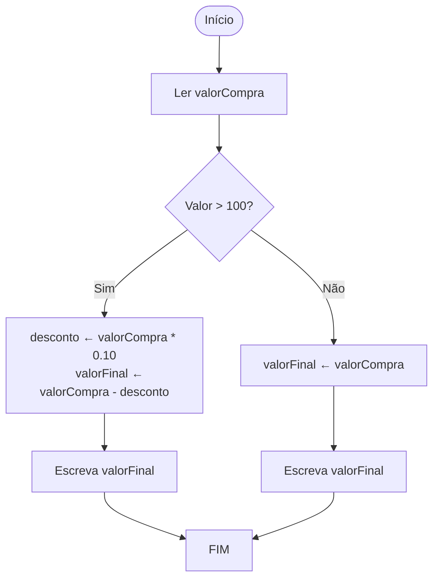

```mermaid
flowchart TD
    A([Início]) --> B[Ler valorCompra] --> C{Valor > 100?}

    C -- Sim --> D[desconto ← valorCompra * 0.10
    valorFinal ← valorCompra - desconto]
    C -- Não --> E[valorFinal ← valorCompra]
    E -->F[Escreva valorFinal]

    D --> G[Escreva valorFinal]-->H[FIM]
    F --> H
    
    
   
```