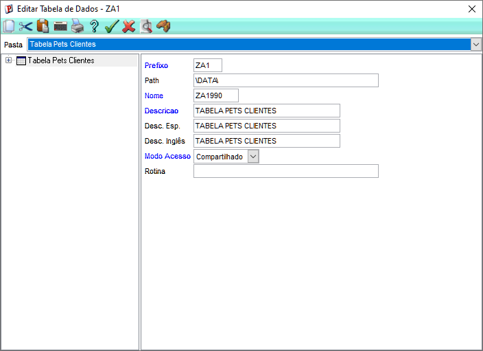
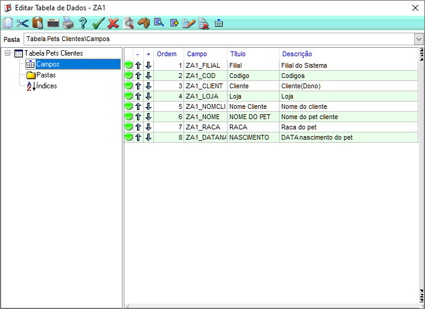
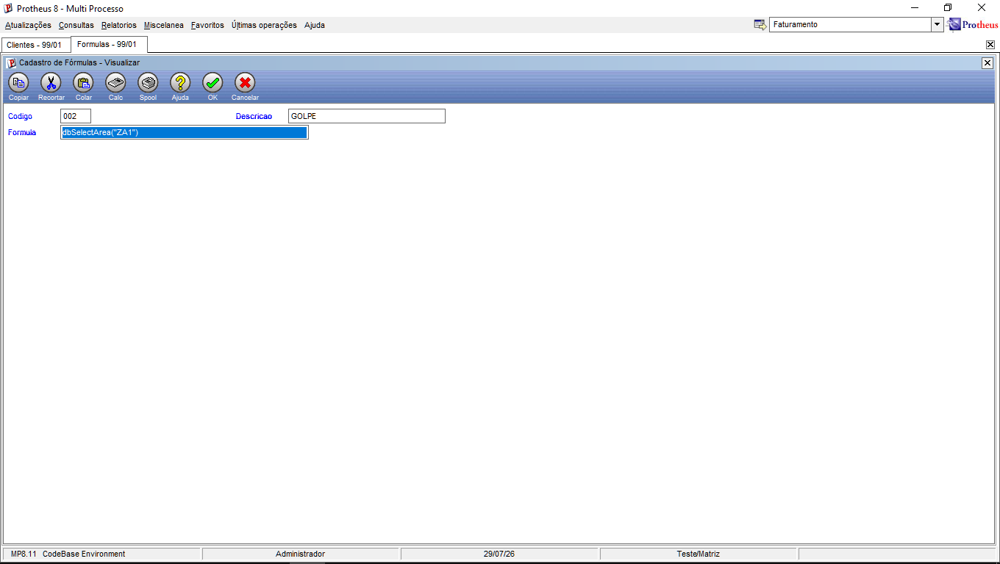

# Recriando a ZA1 no Configurador

## a. Cadastre a estrutura no dicionário (SX2/SX3).
1. **ACESSO AO SIGCDG**: Confirmar credenciais.
2. **Cadastrar estrutura:** 
   * Base de Dados > Dicionário > Base de Dados.
   * Inserir um novo registro na tabela **SX2** (`ZA1` - Cadastro de Pets).

* Campos de ZA1

## b. Force o reconhecimento da tabela pelo framework
**ACESSO AO SIGAMDI**: Atualizações > Cadastro > Fórmula

## MPSDU
**ACESSO AO MPSDU**: Credenciais de Administrador.  
* Arquivo > Abrir > Confirmar > Servidor > data > za11990.dbf
 

* Servidor > system > sx2990.dbf

* Servidor > system > sx3990.dbf

