# SX2
**Tabela já criada com as seguintes funções:**
| Campo | Valor |
|--------|--------|
| Prefixo | ZA1 |
| Nome | ZA1990 |
| Descrição | Cadastro de Pets |
| Path | \DATA\ |
| Modo de Acesso | Compartilhado |  

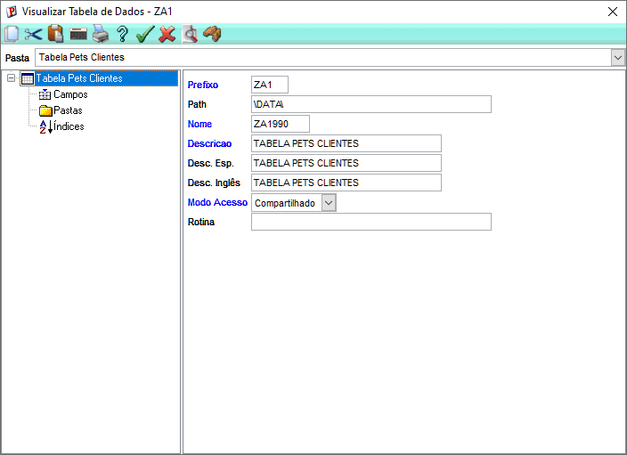

# SX3
**Completando a tabela com novos campos:** 
| Campo | Tipo | Tamanho | Descrição |
|--------|------|----------|-----------|
| ZA1_COD | Caracter | 6 | Código do Pet |
| ZA1_NOME | Caracter | 40 | Nome do Pet |
| ZA1_CLIENT | Caracter | 6 | Código do Cliente |
| ZA1_LOJA | Caracter | 2 | Loja do Cliente |
| ZA1_DATANA | Data | 8 | Data de Nascimento |
| ZA1_RACA | Caracter | 30 | Raça do Pet |
| ZA1_NOMCLI | Virtual | 40 | Nome do Cliente |


## NCLUSÂO DOS CAMPOS
### **ZA1_COD**
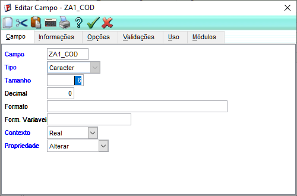
### **ZA1_NOME**
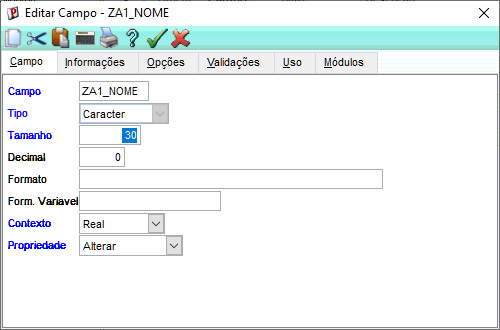
### **ZA1_CLIENT**
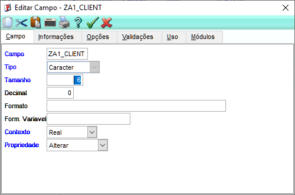
### **ZA1_LOJA**
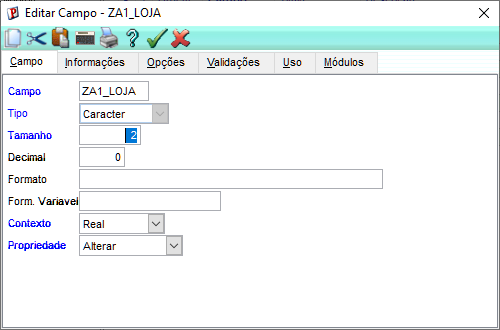
### **ZA1_DATANA**
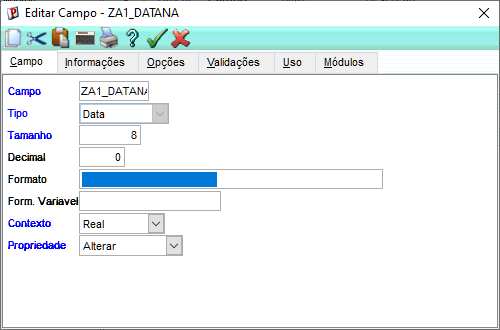
### **ZA1_RACA**
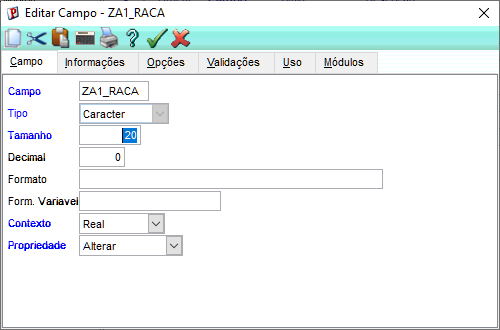
### **ZA1_NOMCLI**

### Campos Completos
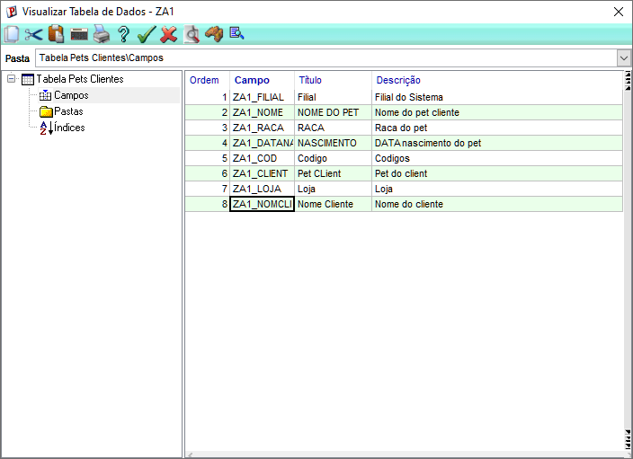

### Relação do campo ZA1_NOMCLI (campo virtual)

```advpl
POSICIONE("SA1",1,xFilial("SA1")+M->ZA1_CLIENT+M->ZA1_LOJA,"A1_NOME")
```
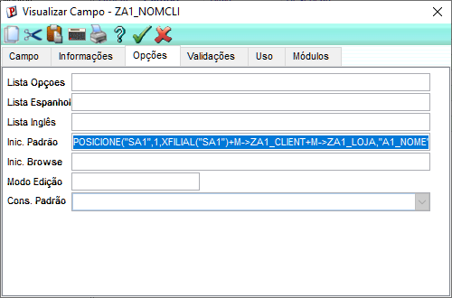

# Criação dos índices para a tabela

**ÍNDICE 1: ZA1_FILIAL + ZA1_COD** 
  
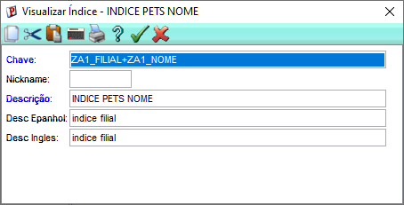

**ÍNDICE 2: ZA1_FILIAL + ZA1_CLIENT + ZA1_LOJA**  

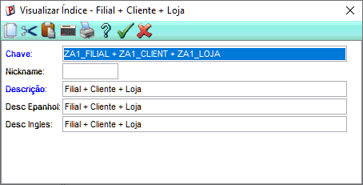

## Índices criados:
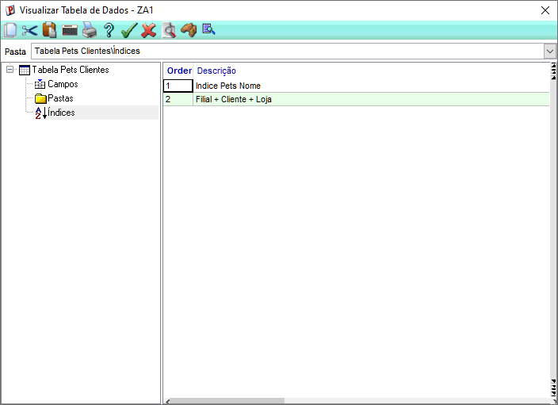