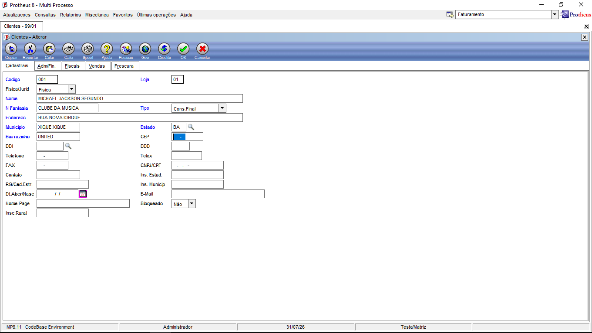
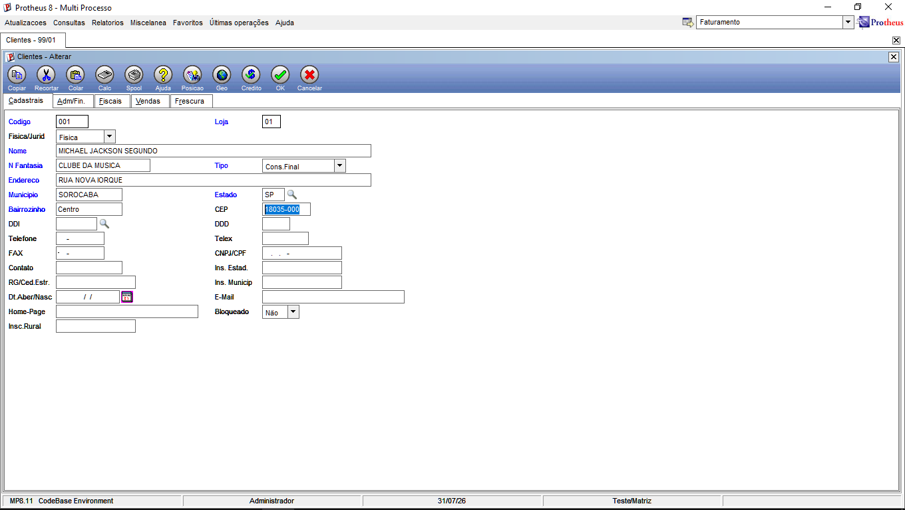

# Gatilhos CEP

## Prints

## a. Qual a diferença entre campo, contra-domínio e regra num gatilho?

Campo é onde começa o gatilho, ao sair com o tab depois de alterar, o gatilho é disparado.

Contra-domínio é o campo que receberá o valor calculado pelo gatilho

Regra vai ser a função que é executada para calcular o valor que vai preencher o contra-domínio.

## b. Por que a regra usa M->A1_CEP e não SA1->A1_CEP ?

M-> vai apontar para a variável de memória da tela que contém o valor que acabamos de digitar

SA1-> aponta para o banco de dados, ele vai verificar o cep já existente na tabela e o gatilho leria o antigo ao invés do novo.

## c. Os CEPs estão dentro do fonte. Cite dois problemas disso em produção e como você resolveria (pense em tabela do dicionário e em serviço externo).

1 Qualquer cep novo ou alterado exige alterar o código fonte, compilar e derrubar/reiniciar o servidor.

2 O cóigo vai ficando inflado e lento para cobrir muitos ceps do brasil.

Criar uma tabela customizada no protheus para cadastrar os ceps na tela e o código passaria a usar um dbSeek nessa tabela;

Consumir uma Api Rest usando as funções HttpQuote ou FWRest dentro do fonte para buscar o endereço em tempo real na internet.

## d. Se pedissem para preencher também o código do município ( A1_COD_MUN ), o que você faria?

Adicionaria uma nova coluna no array para guardar o código do município e trataria o retorno em um do case/condicional, no SIGACFG uma nova sequência 004 no campo A1_CEP tendo um contra-domínio com o A1_COD_MUN.