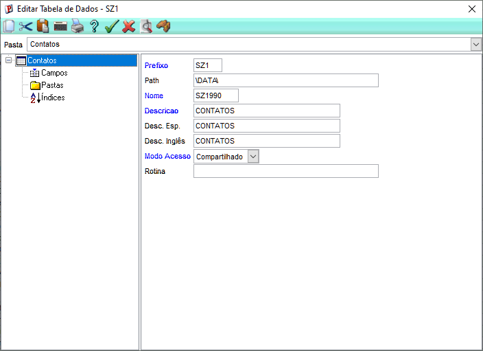
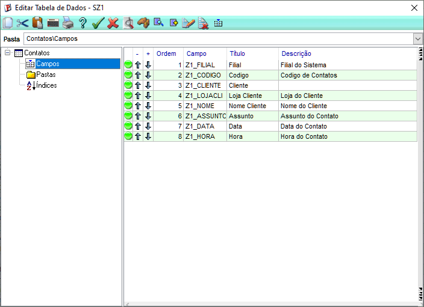
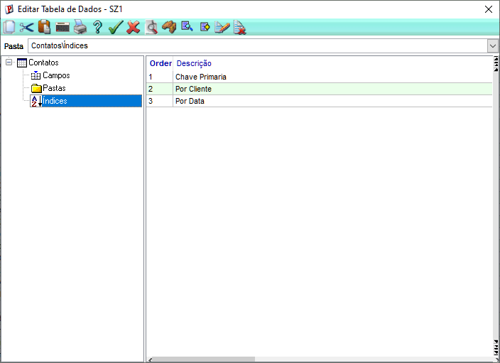
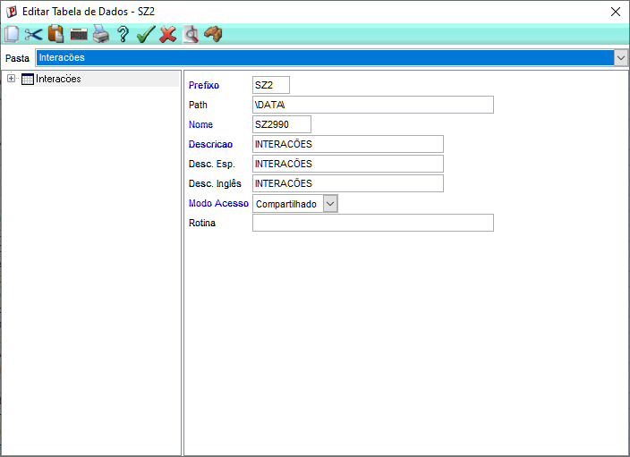
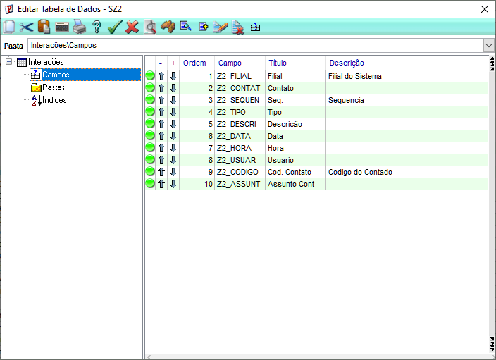
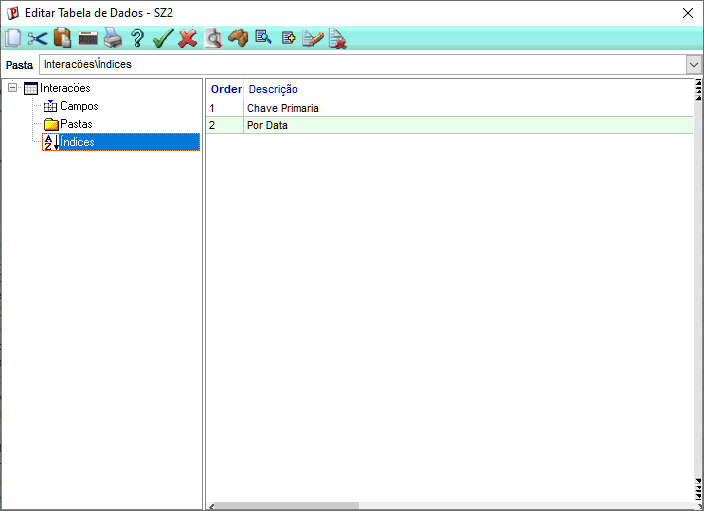
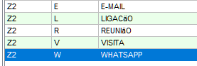

# Dicionário de dados completo

## Configure no dicionário as duas tabelas do projeto: SZ1 e SZ2

# CRIAÇÂO TABELA SZ1
**ACESSO AO SIGACFG**: Aceitar credenciais > Base de dados > Dicionário > Base de Dados

**Configurar tabela da seguinte maneira:** 

Modo Compartilhado

| Campo | Tipo | Tamanho | Contexto |
|--------|------|----------|-----------|
| Z1_FILIAL | Caracter | 2 | Real |
| Z1_CODIGO | Caracter | 6 | Real |
| Z1_CLIENTE | Caracter | 6 | Real |
| Z1_LOJACLI | Caracter | 2 | Real |
| Z1_NOME | Caracter | 40 | Virtual |
| Z1_ASSUNTO | Caracter | 60 | Real |
| Z1_DATA | Data | 8 | Real |
| Z1_HORA | Caracter | 5 | Real |

**ÍNDICES:**

Ordem  | Expressão  | Descrição  
1 | Z1_FILIAL + Z1_CODIGO | Chave primária  
2 | Z1_FILIAL + Z1_CLIENTE + Z1_LOJACLI | Por cliente   
3 | Z1_FILIAL + DTOS(Z1_DATA) | Por data

# CRIAÇÂO TABELA SZ2

**Configurar tabela da seguinte maneira:** 

Modo Compartilhado

| Campo | Tipo | Tamanho | Contexto |
|--------|------|----------|-----------|
| Z2_FILIAL | Caracter | 2 | Real |
| Z2_CONTAT | Caracter | 6 | Real |
| Z2_SEQUEN | Caracter | 3 | Real |
| Z2_TIPO | Caracter | 1 | Real |
| Z2_DESCRI | Caracter | 100 | Real |
| Z2_DATA | Data | 8 | Real |
| Z2_HORA | Caracter | 5 | Real |
| Z2_USUAR | Caracter | 20 | Real |
| Z2_CODIGO | Caracter | 6 | Virtual |
| Z2_ASSUNTRA | Caracter | 6 | Virtual |

**ÍNDICES:**

Ordem | Expressão | Descrição  
1 | Z2_FILIAL + Z2_CONTAT + Z2_SEQUEN | Chave primária  
2 | Z2_FILIAL + DTOS(Z2_DATA) | Por data

**Domínio dos tipos de interação (SX5)**

Chave | Descrição  
E | E-mail  
L | Ligação  
R |  Reunião  
V |  Visita  
W |  WhatsApp  

