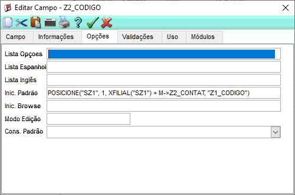
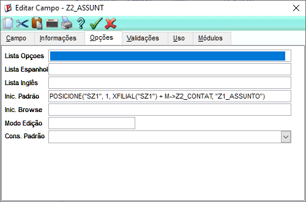
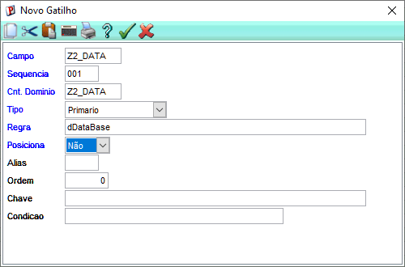
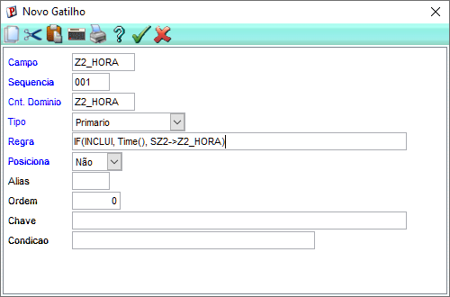
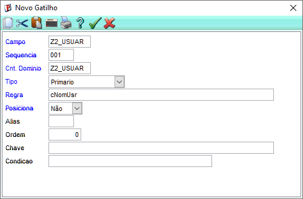

# Gatilhos, campos virtuais e validações cruzadas

## Relacionar Codigo
**ACESSO AO SIGACFG**: Validar credenciais > Base de dados > Dicionário > Base de dados > Tabela SZ2 > Campo Z2_CODIGO:

Relação:   
POSICIONE("SZ1", 1, xFilial("SZ1") + M->Z2_CONTAT, "Z1_CODIGO")

Campo Z2_ASSUNT: 

Relação:  
POSICIONE("SZ1", 1, xFilial("SZ1") + M->Z2_CONTAT, "Z1_ASSUNTO")

## Gatilhos
**ACESSO AO SIGACFG**: Base de Dados > Dicionário > Gatilhos:

1. Gatilhos automáticos na SZ2:
* Z2_DATA → dDataBase (fase 1)  

* Z2_HORA → IF(INCLUI, Time(), SZ2->Z2_HORA) (fase 3)  

* Z2_USUAR → cNomUsr (fase 1) 

## Validação
**ACESSO AO SIGACFG**: Validar credenciais > Base de dados > Dicionário > Base de dados > Tabela SZ2 > Campo Z2_CONTAT:

1. Validação cruzada no X3_VALID do Z2_CONTAT :
    * ExistCpo("SZ1", xFilial("SZ1") + M->Z2_CONTAT, 1)

