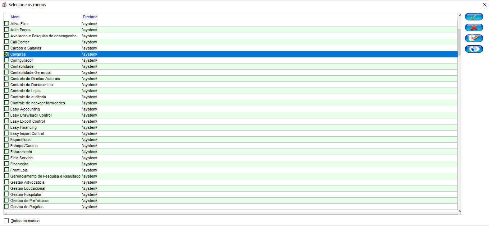
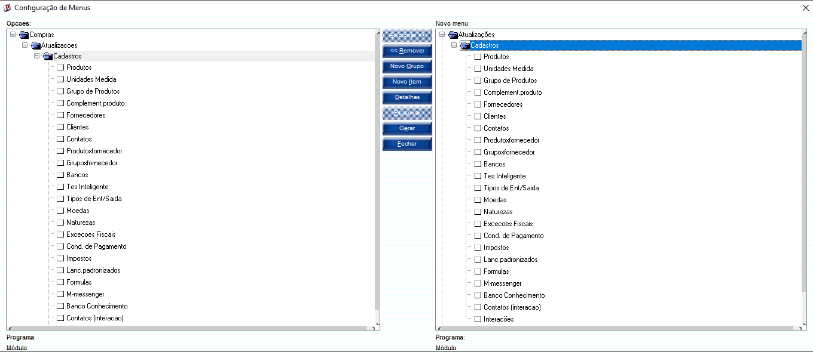
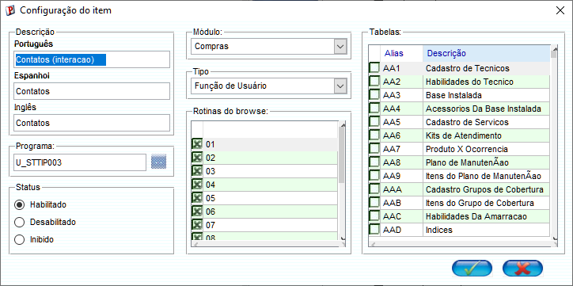
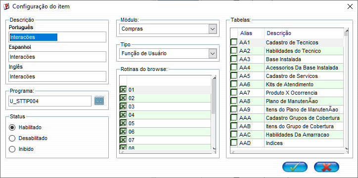
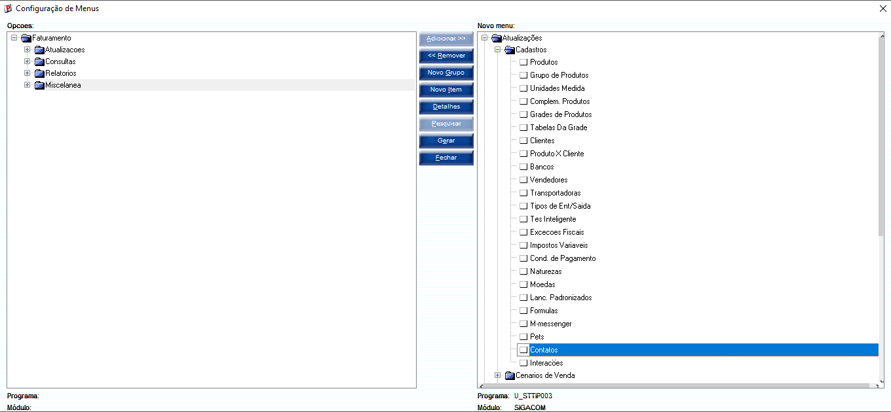
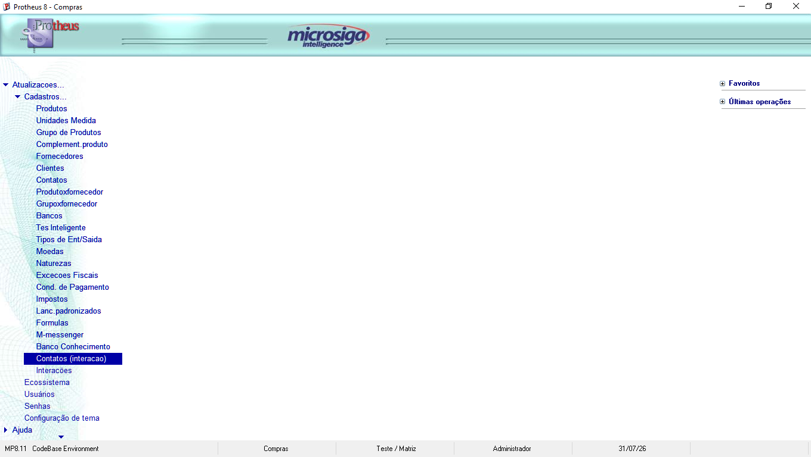

# Menu no SIGACOM

## Fazer os menus de cadastro da tabela no SIGACOM

**ACESSO AO SIGACFG**: Validar credenciais > Ambiente > Cadastros > Menus:

**AO CARREGAR**: Desmarcar todos e marcar apenas a opção COMPRA e CONFIRMAR:

**AO CONFIRMAR:** Expandir compras > expandir atualizações > Clicar em cadastro > Clicar Botão Adicionar: 

**FAZER AOS 2 MENUS:** Novo Item > Configurar > Marcar Tabela Correspondente:

**GERAR SIGACOM**: Gera > SIGACOM > CONFIRMAR

**Menus Criados**

**SALVAR E FECHAR**

**ACESSO AO SIGACOM**: confirmar credencias: 

